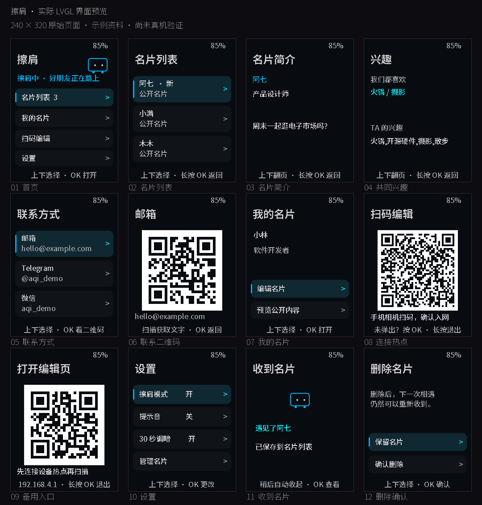

**简体中文** · [English](README.md)

# 擦肩 · StreetPass for AI Passport

**随身带一点关于自己的事，留给路上遇见的人。**

为 FoloToy AI Passport 开发的离线社交名片固件。设备靠近时通过蓝牙交换公开名片，手机连接设备自己的 Wi-Fi 热点即可编辑。日常使用不需要账号、云服务器、互联网或配套 App。

[](https://github.com/VictorTran1023/ai-passport-streetpass/actions/workflows/ci.yml)
[](LICENSE)

**当前状态：第一版软件原型。** 本地固件构建和主机测试通过，双机交换及手机兼容性仍待真机验证。本项目基于 [FoloToy AI Passport](https://github.com/FoloToy/ai-passport) 独立开发，并非 FoloToy 官方发行版。

[使用说明](docs/assets/streetpass-guide.zh_CN.md) · [手机编辑页](assets/images/streetpass-phone-editor-v1.png) · [构建环境](docs/development/environment-setup.zh_CN.md) · [反馈问题](https://github.com/VictorTran1023/ai-passport-streetpass/issues)

## 安静的界面，留给偶然的相遇



使用虚构资料在电脑上渲染的实际 240 x 320 LVGL 页面。深灰底色、蓝色选中提示，配一个小信封角色。这是代码渲染预览，并非真机照片。

## 可以做什么

| 功能 | 首版行为 |
| --- | --- |
| 公开名片 | 昵称、简介、留言、兴趣，以及可选邮箱、Telegram、微信 |
| 擦肩相遇 | 兼容设备通过 BLE 发现和交换名片，收到后保存到本机 |
| 名片列表 | 最多 100 位路人，版本去重、更新未读、收藏和删除 |
| 手机编辑 | 临时 WPA2 热点、入网二维码、本地浏览器编辑页和备用网址二维码 |
| 联系方式 | 可选公开字段，界面文字可以显示为二维码 |
| 随身使用 | 上／下／OK 实体键、保存设置、可选提示音及闲置调暗 |

列表满时替换最旧的未收藏名片；全部收藏时拒收新名片。首版不包含 NFC、私密聊天、身份认证或云同步。

## 怎样使用

1. 在设备打开**扫码编辑**，手机扫描 Wi-Fi 码并确认加入热点。编辑期间暂停蓝牙擦肩。
2. 打开本地编辑页。手机没有自动弹出登录页时，按设备 OK 显示第二个二维码，或在已连接热点的情况下访问 `http://192.168.4.1`。
3. 写好名片，选择是否公开联系方式，预览并保存，等待成功提示。长按设备 OK 退出编辑；设置中未暂停擦肩时，蓝牙恢复。
4. 带着两台兼容设备靠近。打开名片列表，读一段留言、看看共同兴趣，或显示联系方式二维码。

上／下选择，OK 打开，长按 OK 返回。在他人名片页面，长按上键收藏或取消，长按下键请求删除，删除还需单独确认。详见[完整按键表](docs/assets/streetpass-guide.zh_CN.md#按键)。

**公开范围：**附近兼容的蓝牙客户端可以读取名片，请只填写愿意公开的内容。取消某字段只影响今后的交换，不能远程删除他人已经收到的副本。联系二维码包含文字，不会自动添加微信好友。

## 构建与验证

硬件目标：**ESP32-C3、8 MB Flash、无 PSRAM、ESP-IDF 5.5.3**。依赖和 Windows 环境配置见[环境搭建说明](docs/development/environment-setup.zh_CN.md)。在已激活 ESP-IDF 的 Bash 中运行：

```bash
git clone https://github.com/VictorTran1023/ai-passport-streetpass.git
cd ai-passport-streetpass
# Activate your installed ESP-IDF 5.5.3 environment first.
./tools/validate.sh --static
./tools/validate.sh --firmware
```

固件检查会生成 `build/FoloToy-AI-Passport-full.bin`，这是经过校验、从 `0x0` 写入的合并镜像。构建产物不进入源码提交。成功的 CI 运行也会提供可下载的 Actions 固件产物，保留七天；它不等于通过真机验证的正式版本。刷机前请阅读[硬件与烧录说明](docs/hardware-design/AI_HARDWARE_DEVELOPMENT_GUIDE.zh_CN.md)。

保留 3 MB 应用上限、`0x356000` 的受保护 `cardid`、`0x700000` 的永久 Recovery，以及长按上键五秒的 bootloader 入口。名片使用独立 NVS 分区。主机存储测试使用 NVS 替身，不能证明真实 Flash 或断电行为。

| 验证项目 | 已记录结果 |
| --- | --- |
| Build | 本地 ESP-IDF 5.5.3 构建 PASS；应用 2,383,008 / 3,145,728 字节 |
| Host tests | PASS：协议、导航、存储和仓库检查 |
| UI 与编辑页 | 真实 LVGL 渲染、二维码解码、桌面浏览器编辑页检查通过 |
| Device tests | NOT RUN |
| Unverified | 步行擦肩、手机自动弹页、耗电、无线功能内存及实体 Recovery |

带日期的产物校验值和验证边界见[验证记录](docs/assets/streetpass-guide.zh_CN.md#软件验证记录2026-09-21)。上方工作流徽章显示当前远程检查状态，与这里记录的本地结果分别展示。

## 项目结构

| 路径 | 职责 |
| --- | --- |
| `main/sp_core.*`、`main/sp_nav.*` | 有边界限制的名片格式、蓝牙分片和导航逻辑 |
| `main/sp_store.*` | 本地名片和列表持久化 |
| `main/sp_ble.*` | BLE 发现与传输状态机 |
| `main/sp_web.*`、`main/sp_editor.html` | 临时热点与内置手机编辑页 |
| `main/sp_ui.*` | 设备页面与深色主题 |
| `components/bsp/` | 上游板级支持 |
| `tests/`、`tools/` | 主机测试、固件校验和预览工具 |
| `docs/assets/` | 擦肩使用说明和设计决定 |

这是在 `main` 上维护擦肩的独立仓库。保留的上游硬件和示例文档描述原始平台；根目录 README 与擦肩指南描述本应用。继承的 fork 同步工作流会跳过独立仓库。保留上游历史及署名。

## 参与与致谢

参与前请阅读[贡献指南](.github/CONTRIBUTING.zh_CN.md)。反馈问题时请附上板子版本、固件提交、复现步骤，并区分构建与真机测试结果。目前尤其需要上表中待验证行为的实测反馈。可被利用的漏洞细节请按照[安全政策](.github/SECURITY.zh_CN.md)处理。

基于 **FoloToy AI Passport**，保留原始 [MIT 许可证](LICENSE)及版权声明。Noto Sans SC 字体遵循 [SIL Open Font License](assets/fonts/NotoSansSC-LICENSE.txt)。预览资料均为虚构，图片来源与参考资料的使用边界见[素材说明](assets/images/README.zh_CN.md)。
